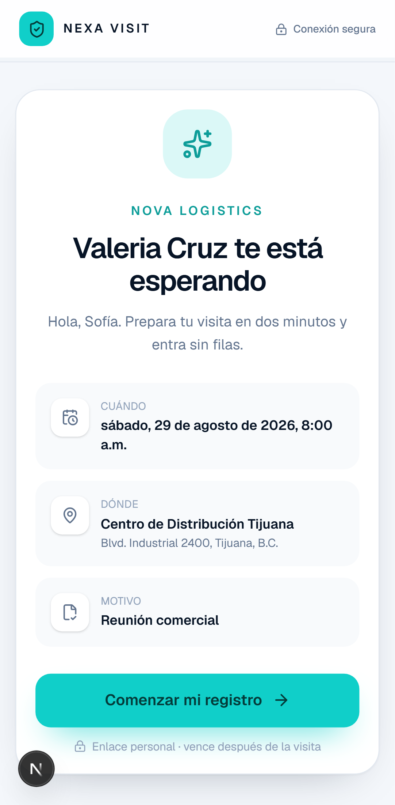
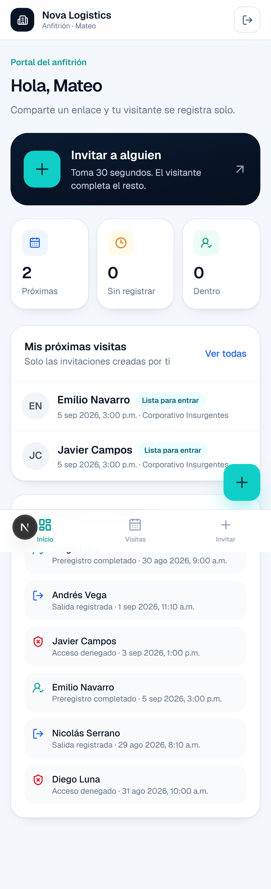
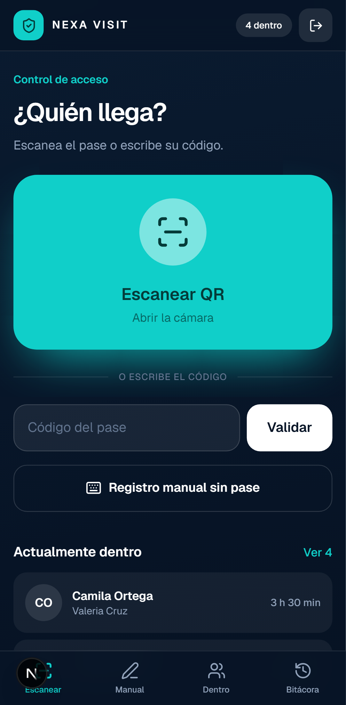
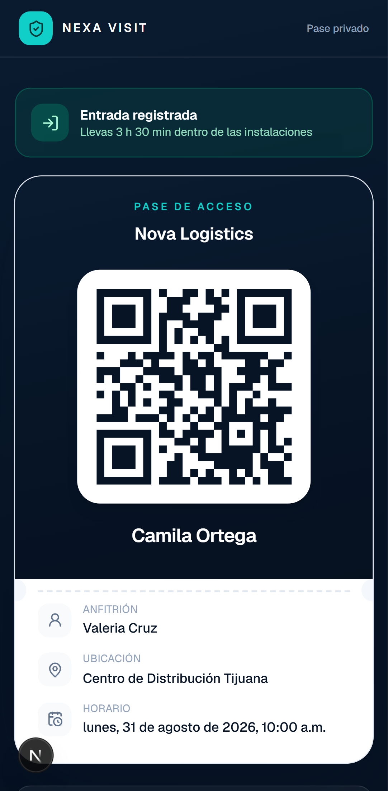
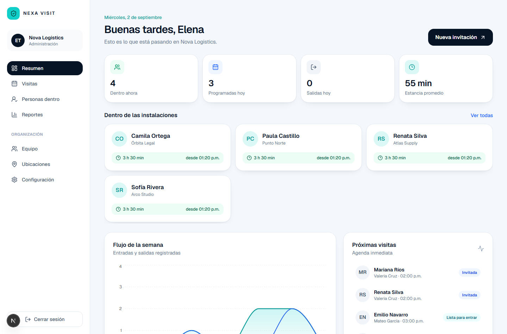

# NEXA VISIT

Plataforma web multiempresa de control de visitantes, **diseñada primero para el teléfono**. El anfitrión comparte un enlace; el visitante se registra solo desde su móvil, recibe un pase QR y el guardia valida su entrada en un toque, arrancando el conteo de tiempo dentro.

Cuatro experiencias sobre una sola base de datos: **administración, anfitrión, guardia y visitante**.



## Cómo funciona

1. **El anfitrión invita.** Elige día, hora y sede. Los datos del visitante son opcionales: puede adelantar todos, algunos o ninguno.
2. **El visitante se registra solo.** Abre el enlace en su teléfono, confirma sus datos, fotografía su identificación (con cámara en vivo y lectura de texto en el propio dispositivo), acepta el aviso de privacidad y recibe su pase.
3. **El pase QR.** Contiene únicamente un token aleatorio: ni nombre, ni correo, ni identificación.
4. **El guardia valida.** Escanea, ve a quién tiene enfrente, autoriza o deniega. Desde ese momento corre el cronómetro de estancia.
5. **La operación mide.** Aforo en vivo, tiempos de permanencia, motivos, anfitriones y exportación a CSV.

## Arrancar sin instalar nada

```bash
npm install
npm run dev
```

Abre <http://localhost:3000> y elige un perfil: **Administración**, **Anfitrión** o **Guardia**.

Sin credenciales de Supabase la plataforma arranca en **modo vitrina**: el recorrido completo funciona con datos locales del navegador, compartidos entre pestañas. Sirve para evaluar la experiencia, no como sustituto de producción.

Rutas útiles en vitrina:

| Portal | Ruta |
| --- | --- |
| Administración | `/app/dashboard` |
| Anfitrión | `/app/host` |
| Guardia | `/guard/scan` |
| Visitante (preregistro) | `/visit/nexa-demo-invitation-2026` |
| Pase de ejemplo | `/pass/nexa-demo-pass-2026` |
| Recorrido explicado | `/demo/visitor` |

## Conectar Supabase (paso a producción)

**No hay que tocar código.** En cuanto existan credenciales, la plataforma exige autenticación real, aplica RLS y guarda documentos en almacenamiento privado.

```bash
copy .env.example .env.local     # macOS/Linux: cp .env.example .env.local
npx supabase start               # requiere Docker Desktop
npx supabase db reset            # aplica migraciones + seed demostrativo
```

Copia `NEXT_PUBLIC_SUPABASE_URL`, `NEXT_PUBLIC_SUPABASE_ANON_KEY` y `SUPABASE_SERVICE_ROLE_KEY` de `npx supabase status` a `.env.local`, reinicia `npm run dev` y entra a `/signup`.

> **Un paso que se olvida:** los correos de confirmación de cuenta no salen por Resend, los manda Supabase Auth. Sin configurar SMTP propio en el panel de Supabase, quien se registre nunca recibirá el correo. Está explicado en [docs/INTEGRACIONES.md](docs/INTEGRACIONES.md#12-correos-de-cuenta--smtp-de-supabase).

### En la nube

1. Crea el proyecto y enlázalo: `npx supabase link --project-ref <ref>`.
2. Publica el esquema: `npx supabase db push`.
3. Configura en Auth el dominio del sitio y las URLs de redirección (`/auth/callback`).
4. Ejecuta el seed **solo** en ambientes de demostración.
5. Define `CRON_SECRET`; `vercel.json` llama a diario a `/api/cron/purge-documents`.

El bucket `visitor-documents` es privado. Las rutas empiezan con `organization_id`, la lectura depende de RLS y la vista se entrega siempre con URL firmada de 60 segundos, dejando registro en la bitácora.

### Alta de una empresa

`/signup` crea la cuenta y `/onboarding` la organización. En una sola transacción quedan creados: organización, membresía de administración, aviso de privacidad y primera ubicación. A partir de ahí se invita al equipo desde **Equipo**.

## Los cuatro portales

### Administración
Aforo en vivo con cronómetro por persona, flujo semanal, próximas visitas, actividad, reportes con filtros y CSV, equipo (alta, cambio de rol, suspensión), ubicaciones y configuración de privacidad.

### Anfitrión
Un botón para invitar, aviso cuando su visitante llega, compartir el enlace por el diálogo nativo del sistema (WhatsApp, correo, lo que tenga el teléfono) y visibilidad **únicamente** de sus propias visitas, garantizada por RLS.

### Guardia
Escáner a pantalla completa con marco guía, validación por código manual como respaldo, ficha del visitante con requisitos de acceso y notas, autorización explícita fuera de ventana, rechazo con motivo obligatorio, alta manual sin pase y bitácora del turno. Vibración corta al leer y confirmar.

### Visitante
Sin cuenta ni aplicación. Cinco pasos, captura con cámara en vivo, lectura de texto local, corrección de cualquier campo, consentimiento con el aviso real de la organización y su plazo de retención, y pase QR descargable.

## Seguridad y privacidad

- `organization_id` y RLS en todas las tablas operativas; roles aplicados en SQL y en la interfaz.
- Invitaciones y pases guardados como SHA-256 (`public.token_hash`), nunca en texto plano.
- `record_access_decision` bloquea la fila, revalida el estado y escribe evento y auditoría en la misma transacción.
- `resolve_qr_token` valida la organización **dentro** de la función, no solo en la API.
- Documentos en bucket privado, 8 MiB máximo, allowlist JPG/PNG/WebP, retención configurable y borrado físico antes de marcar la fila.
- Identificación enmascarada (solo los últimos cuatro dígitos) en los datos operativos.
- Consentimiento explícito, versionado del aviso y registro de qué versión aceptó cada visitante.
- Llave de servicio exclusiva del servidor; redirecciones restringidas a rutas internas; CSV protegido contra fórmulas; correos con todo el texto dinámico escapado.
- IP no persistida: solo se usa de forma transitoria para limitar abuso.

## Lectura de identificaciones

El visitante fotografía **las dos caras** de su credencial. El reverso es el que se lee: las credenciales para votar recientes traen ahí una banda MRZ (norma ICAO 9303, formato TD1) con **dígitos de control**, así que la lectura se puede *verificar* en lugar de confiar en ella. Cuando los cuatro cuadran, la interfaz muestra «Lectura verificada» y extrae nombre, fecha de nacimiento, vigencia y CURP.

Todo ocurre en el teléfono del visitante: la imagen no se envía a ningún servicio de terceros para analizarla. Los archivos del motor se sirven desde el propio dominio (`npm run setup:ocr`), no desde un CDN, para poder mantener la CSP estricta.

```bash
npm run setup:ocr                    # una vez; `npm run build` ya lo ejecuta
NEXT_PUBLIC_OCR_PROVIDER=tesseract
```

Sin esa variable se usa un proveedor reproducible que devuelve una banda de ejemplo bien formada, útil para demostraciones y pruebas.

**Con honestidad:** el OCR extrae texto, no valida que la credencial sea auténtica ni hace reconocimiento facial. Si el documento no tiene banda MRZ —credenciales antiguas, gafetes— el visitante escribe sus datos y el flujo sigue igual. Todo campo es editable y la interfaz avisa cuando la lectura no quedó comprobada. Para verificación de autenticidad o prueba de vida hace falta un servicio especializado; ver [integraciones](docs/INTEGRACIONES.md).

## Carteras, WhatsApp e instalación

- **Apple Wallet y Google Wallet.** El visitante guarda su pase en la cartera del teléfono. Los botones solo aparecen si el servidor tiene las credenciales; Google no cuesta licencia, Apple requiere el Developer Program.
- **WhatsApp.** El enlace de invitación puede enviarse por la API de Meta Cloud con una plantilla aprobada. Sin configurarlo, el anfitrión comparte el enlace con el botón nativo del teléfono, que abre WhatsApp y no cuesta nada.
- **Aplicación instalable.** Manifiesto, iconos y atajos directos al escáner y a la invitación. En la caseta se instala en la pantalla de inicio y desaparece la barra del navegador.

Los pasos de cada una están en [docs/INTEGRACIONES.md](docs/INTEGRACIONES.md).

## Pruebas

```bash
npm run lint
npm run typecheck
npm test
npm run test:e2e     # npx playwright install chromium (una vez)
npm run build
```

`npm run check` encadena lint, TypeScript, unitarias y build.

Las 55 unitarias cubren las reglas de acceso (ventanas configurables, duplicados, rechazo con motivo, expiración), el lector de MRZ —validado contra el ejemplo canónico de la norma ICAO 9303, incluidos los dígitos de control—, el hashing verificado contra el mismo valor que produce PostgreSQL, el enmascarado, el CSV, las redirecciones y el cálculo de estancia. Los 14 E2E recorren anfitrión → visitante → guardia → administración y verifican el aislamiento entre portales, en escritorio y en móvil.

## Arquitectura

- Next.js 16 (App Router, Route Handlers, `proxy.ts`) y React 19.
- Server Components por defecto; cliente solo donde hay cámara, formularios, gráficas o estado en vivo.
- Supabase PostgreSQL/Auth/Storage como fuente productiva; RLS como frontera autoritativa.
- Un solo contrato de dominio (`src/lib/domain.ts`) para servidor y cliente: la interfaz es idéntica en vitrina y en producción.
- Un único reloj compartido (`src/lib/clock.ts`) alimenta todos los cronómetros en vivo.

Consulta [decisiones](docs/DECISIONS.md), [integraciones](docs/INTEGRACIONES.md), [limitaciones](docs/LIMITATIONS.md) y [checklist de producción](docs/PRODUCTION_CHECKLIST.md).

> **¿Vas a conectar la base de datos?** [`docs/HANDOFF-SUPABASE.md`](docs/HANDOFF-SUPABASE.md) es el guion paso a paso: migraciones, verificaciones con el SQL exacto y su resultado esperado, y los criterios para dar el trabajo por bueno.

## Capturas

| Anfitrión | Guardia | Pase |
| --- | --- | --- |
|  |  |  |



## Estructura

```text
src/app/                 rutas y API
src/components/          interfaz de los cuatro portales
src/components/ui.tsx    primitivas de diseño
src/lib/ocr/             lector de MRZ y proveedores de reconocimiento
src/lib/                 dominio, seguridad y adaptadores
src/lib/server/          Supabase, sesión, correo, WhatsApp y carteras
scripts/setup-ocr.mjs    prepara el motor de OCR local
src/proxy.ts             refresco de sesión y guardas optimistas
supabase/migrations/     esquema, funciones y RLS
tests/e2e/               recorridos Playwright
docs/                    decisiones, limitaciones y checklist
```
